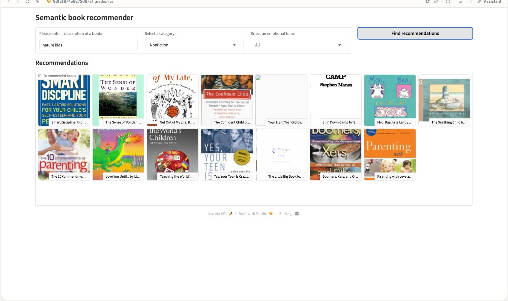
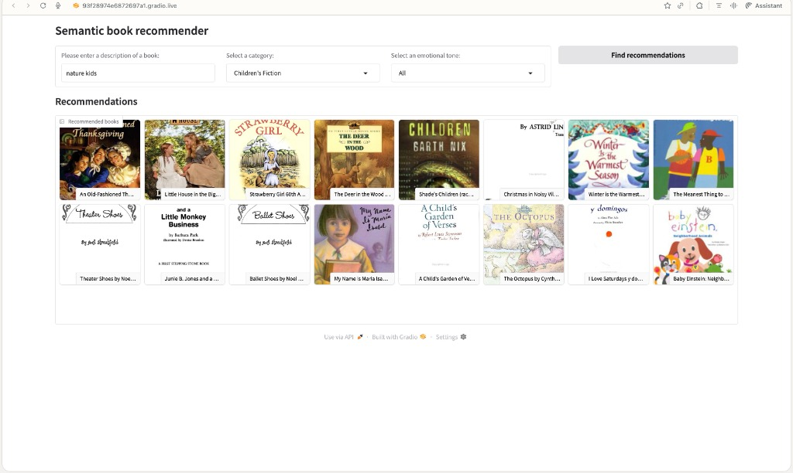
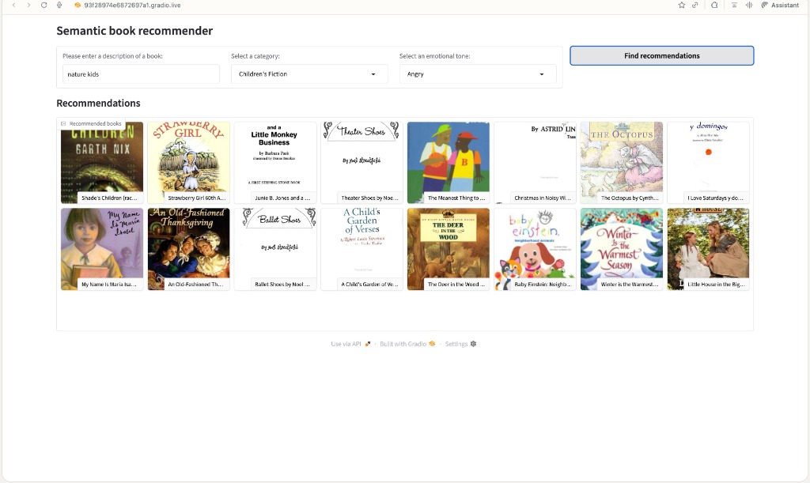
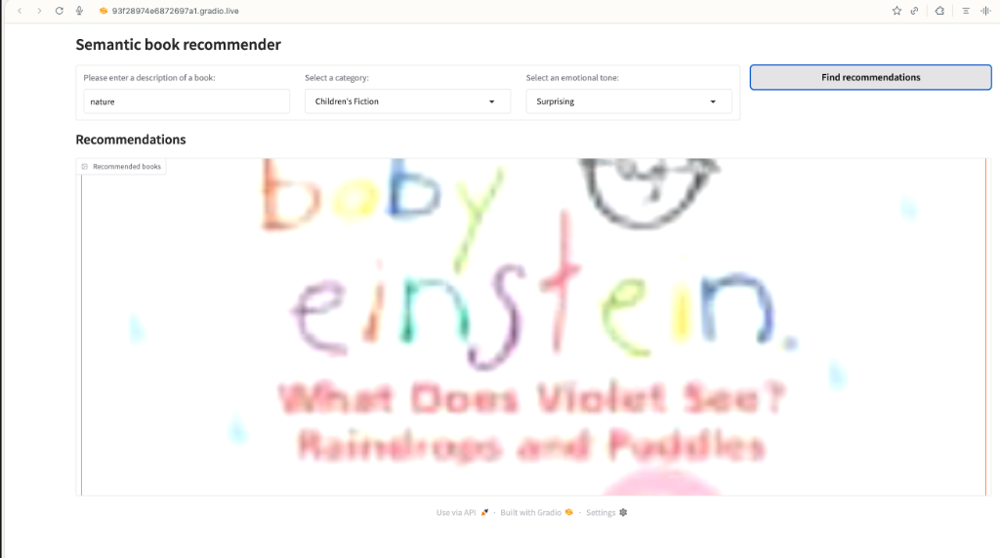

# 📚 Semantic Book Recommender

An intelligent book recommendation system powered by **semantic search**, **zero-shot classification**, and **sentiment analysis**. This project demonstrates advanced NLP techniques using OpenAI embeddings, ChromaDB vector database, and transformer models to deliver personalized book recommendations based on natural language queries and emotional preferences.

[](https://www.python.org/downloads/)
[](https://huggingface.co/transformers/)
[](https://gradio.app/)

## � Live Demo

**Try it now**: [Hugging Face Spaces Demo](https://huggingface.co/spaces/something111-del/book-recommender)

Experience the full semantic search and sentiment analysis features powered by OpenAI embeddings - no setup required!

## �🌟 Features

- **Semantic Search**: Natural language queries powered by OpenAI embeddings (e.g., "books about nature for kids")
- **Zero-Shot Classification**: Automatic Fiction/Nonfiction categorization using `facebook/bart-large-mnli`
- **Sentiment Analysis**: Emotion-based filtering using `j-hartmann/emotion-english-distilroberta-base`
- **Interactive Dashboard**: Beautiful Gradio interface with book covers and descriptions
- **Vector Database**: Persistent ChromaDB storage for fast similarity search

## 📊 Dataset

**Source**: 7,000 Books with Metadata from Kaggle

The dataset includes:
- ISBN-13 and ISBN-10
- Title and subtitle
- Authors
- Categories
- Description
- Publication year
- Average rating
- Number of pages
- Ratings count
- Thumbnail URL

### Data Preparation Pipeline

1. **Data Cleaning** (`data-exploration.ipynb`)
   - Removed books with missing descriptions
   - Filtered books with description length < 50 characters
   - Created combined text fields
   - Final dataset: **5,197 books**

2. **Zero-Shot Classification** (`text-classification.ipynb`)
   - Model: `facebook/bart-large-mnli`
   - Classified books into Fiction (60%) and Nonfiction (40%)
   - No training required - leverages pre-trained MNLI knowledge
   - Output: `outputs/books_with_categories.csv`

3. **Sentiment Analysis** (`sentiment-analysis.ipynb`)
   - Model: `j-hartmann/emotion-english-distilroberta-base`
   - Analyzed 7 emotions: anger, disgust, fear, joy, sadness, surprise, neutral
   - Sentence-level analysis with max score aggregation
   - Processing time: ~11 minutes on CPU
   - Output: `books_with_emotions.csv`

4. **Vector Database Creation** (`scripts/initialize_vector_db.py`)
   - Embedding model: OpenAI `text-embedding-ada-002`
   - Generated embeddings for 5,197 book descriptions
   - Stored in ChromaDB with persistent storage
   - Database size: ~95MB
   - Location: `data/chroma_db/`

## 🧠 How It Works

### Semantic Search Architecture

```
User Query → OpenAI Embeddings → Vector Similarity Search → Top-K Results → Category Filter → Sentiment Sort → Display
```

1. **Query Embedding**: User's natural language query is converted to a 1536-dimensional vector using OpenAI's embedding model
2. **Similarity Search**: ChromaDB performs cosine similarity search against 5,197 pre-computed book embeddings
3. **Filtering**: Results are filtered by category (Fiction/Nonfiction) if specified
4. **Sentiment Ranking**: Books are sorted by emotional tone (Happy, Sad, Suspenseful, etc.) if requested
5. **Display**: Top 16 results shown with book covers and descriptions

### Models Used

| Component | Model | Purpose |
|-----------|-------|---------|
| Embeddings | OpenAI `text-embedding-ada-002` | Semantic search |
| Classification | `facebook/bart-large-mnli` | Fiction/Nonfiction categorization |
| Sentiment | `j-hartmann/emotion-english-distilroberta-base` | Emotion detection |

## 🎯 Demo Results

The system demonstrates intelligent understanding of complex queries combining semantic meaning, category, and emotional tone:

### Example 1: Nonfiction Nature Books for Kids
**Query**: "nature kids" | **Category**: Nonfiction | **Tone**: All



**Analysis**: The system correctly identifies educational, fact-based books about nature suitable for children. Results include "The Sense of Wonder," "Brain Discipline," and "Teaching the World's Children" - all emphasizing learning and discovery.

### Example 2: Fiction Nature Books for Kids
**Query**: "nature kids" | **Category**: Children's Fiction | **Tone**: All



**Analysis**: When switched to fiction, the system returns story-based books like "Strawberry Girl," "Little House in the Big Woods," and "A Child's Garden of Verses" - narrative works featuring nature themes for children.

### Example 3: Angry Tone with Nature Theme
**Query**: "nature kids" | **Category**: Children's Fiction | **Tone**: Angry



**Analysis**: The sentiment filter attempts to find books with "angry" emotional content. Since children's nature books rarely have strong anger themes, the system returns books with mild conflict or tension like "Little Monkey Business" and "Theater Shoes" - demonstrating graceful degradation when exact matches are scarce.

### Example 4: Surprising Tone with Nature Theme
**Query**: "nature" | **Category**: Children's Fiction | **Tone**: Surprising



**Analysis**: The system identifies "Baby Einstein: What Does Violet See? Rainbows and Puddles" - a book designed to evoke wonder and surprise in young readers through discovery of natural phenomena. This demonstrates the model's ability to understand subtle emotional nuances like "surprise" in the context of learning and exploration.

## 🚀 Setup Instructions

### Prerequisites

- Python 3.12+
- OpenAI API key
- 10GB free disk space (for vector database and models)

### Installation

1. **Clone the repository**
   ```bash
   git clone https://github.com/something111-del/book-recommender.git
   cd book-recommender
   ```

2. **Create virtual environment**
   ```bash
   python -m venv .venv
   source .venv/bin/activate  # On Windows: .venv\\Scripts\\activate
   ```

3. **Install dependencies**
   ```bash
   pip install -r requirements.txt
   ```

4. **Set up environment variables**
   ```bash
   echo "OPENAI_API_KEY=your_api_key_here" > .env
   ```

5. **Download the dataset**
   
   Place `books.csv` in the `data/raw/` directory.

### Running the Application

#### Option 1: Quick Start (Pre-processed Data)

If you have the pre-processed files (`books_with_emotions.csv`, `tagged_description.txt`, and `data/chroma_db/`):

```bash
python gradio-dashboard.py
```

Then open http://127.0.0.1:7860 in your browser.

#### Option 2: Full Pipeline (From Scratch)

If starting from raw data:

```bash
# Step 1: Prepare data with emotion analysis (~11 minutes)
python scripts/prepare_data.py

# Step 2: Initialize vector database (~5-10 minutes, requires OpenAI API)
python scripts/initialize_vector_db.py

# Step 3: Launch application
python gradio-dashboard.py
```

#### Option 3: Simplified Dashboard (No OpenAI Required)

For basic browsing without semantic search:

```bash
python scripts/gradio-dashboard-simple.py
```

### Deploying with Public Link

To share your application publicly:

```bash
python gradio-dashboard.py
```

The application will automatically generate a public Gradio link (expires in 1 week).

For permanent hosting:
```bash
gradio deploy
```

## 📁 Project Structure

```
book-recommender/
├── data/
│   ├── raw/                    # Original dataset
│   ├── processed/              # Cleaned data
│   └── chroma_db/              # Vector database (95MB)
├── demo_results/               # Demo screenshots
├── notebooks/                  # Jupyter notebooks
│   ├── data-exploration.ipynb
│   ├── text-classification.ipynb
│   ├── sentiment-analysis.ipynb
│   └── vector-search.ipynb
├── outputs/                    # Intermediate outputs
├── scripts/
│   ├── prepare_data.py         # Data preparation script
│   ├── initialize_vector_db.py # Vector DB initialization
│   └── gradio-dashboard-simple.py # Simplified dashboard
├── gradio-dashboard.py         # Main application
├── books_with_emotions.csv     # Processed data (6.8MB)
├── tagged_description.txt      # Tagged descriptions (2.5MB)
├── requirements.txt            # Dependencies
└── README.md
```

## 🛠️ Development

### Key Dependencies

- `transformers` - Hugging Face transformers for NLP models
- `torch` - PyTorch backend
- `langchain` - LLM application framework
- `langchain-openai` - OpenAI integration
- `langchain-chroma` - ChromaDB integration
- `gradio` - Web UI framework
- `pandas` - Data manipulation
- `openai` - OpenAI API client

### Running Tests

```bash
pytest tests/
```

## 📝 Notebooks

The `notebooks/` directory contains Jupyter notebooks for each pipeline stage:

1. **notebooks/data-exploration.ipynb** - Data cleaning and EDA
2. **notebooks/text-classification.ipynb** - Zero-shot classification with BART-MNLI
3. **notebooks/sentiment-analysis.ipynb** - Emotion analysis with DistilRoBERTa
4. **notebooks/vector-search.ipynb** - Vector database setup and testing

## 🤝 Contributing

Contributions are welcome! Please feel free to submit a Pull Request.

1. Fork the repository
2. Create your feature branch (`git checkout -b feature/AmazingFeature`)
3. Commit your changes (`git commit -m 'Add some AmazingFeature'`)
4. Push to the branch (`git push origin feature/AmazingFeature`)
5. Open a Pull Request

## 📄 License

This project is licensed under the MIT License - see the LICENSE file for details.
